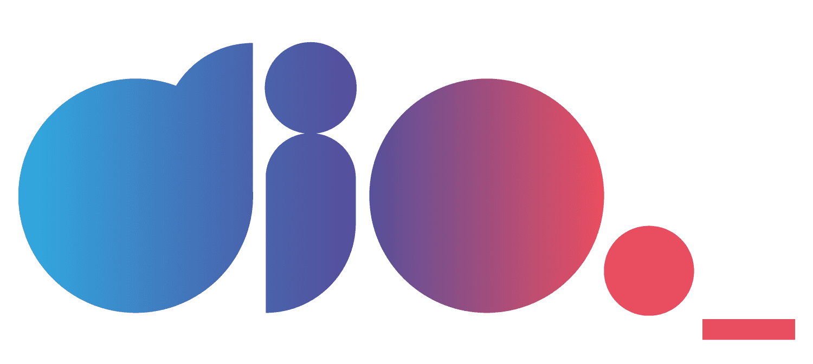

# 🖥️ Bootcamp - "Geração Tech Unimed-BH - Ciência de Dados"

Bem-vindo ao repositório do boot camp **Geração Tech Unimed-BH - Ciência de Dados** da [DIO](https://www.dio.me/)!

 Este repositório foi criado para armazenar todos os projetos desenvolvidos durante a progressão do boot camp.

 

## Sobre o Boot Camp

O **Geração Tech Unimed-BH - Ciência de Dados** é um programa intensivo de treinamento em ciência de dados, projetado para capacitar os participantes com habilidades práticas e teóricas na área. Durante o boot camp, os participantes aprenderão sobre, mas não limitado à, os seguintes tópicos:

### 📖 Módulo 1 - Conceitos iniciais

- Pensamento computacional
- Versionamento com Git e GitHub

### 🐍 Módulo 2 - Programação em Python
- Análise de Dados
- Fundamentos de ETL
- Machine Learning
- Deep Learning
- Processamento de Imagens
- Visualização de Dados

### 💾 Módulo 3 - Banco de dados SQL e NoSQL

- Gerenciamento, modelagem e arquitetura de banco de dados

- Entidades de relacionamento

- Queries com funções e agrupamentos

### ☁️ Módulo 4 - Imersão Cloud Computer

- Conceitos iniciais para manipulação de Big Data com Amazon Web Services (AWS)

### 🤖 Módulo 5 - Machine Learning

 - Aplicações com Python e R

 - Utilização em conjunto com Amazon SageMaker

 - Aplicação dos conceitos de transfer learning

---

Vamos juntos nessa jornada de aprendizado e desenvolvimento em ciência de dados!

## Autor

Olá, eu sou o Pablo.

- ⚡ Bacharelando em Engenharia Elétrica;
- 🐍 Programador python;
- 🤖 Cientista de dados nas horas vagas.

## Contato

## Licença

Licença [MIT](https://github.com/pablo-francisco/Bootcamp_dio/blob/main/LICENSE)

